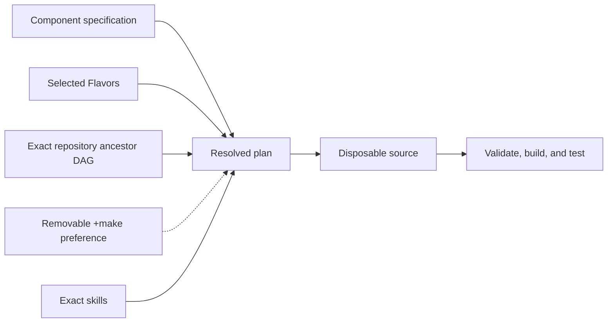

# Project guide

Trove is a small, Git-friendly secret store with per-user public-key access.
The application ships as one self-contained Go executable with embedded OpenPGP.
The existing Makefile implementation is retained for conversion evidence and recovery. See the
project goals in root `PROJECT.md` and the [security remediation plan](roadmap/security-remediation.md)
for the agreed behavior and five-platform binary release matrix.

Start with [getting started](user/getting-started.md) for installation and usage.
See [active work](roadmap/active-work.md) for current development status.
The [native client](user/native-client.md) describes the new Go CLI,
build commands, migration and current qualification limits.
The [retained boundary inventory](architecture/retained-boundaries.md) maps the
existing application to its future Components, Flavors, assets and contributor tests.

See [binary releases](user/releases.md) for maintenance branches, tags, CI and recovery.

## Development

This project is built with [Literate AI](https://github.com/jordanhubbard/literate-ai).
The current Standard lifecycle binding uses a non-editable Litai 1.1.0 installation
built from upstream commit `44b690aebbbfc7cc8db290a26fb1608643d95c10`.
To reproduce it, check out that exact commit in the upstream repository and run
its `make install` target. The default user launcher is `~/.local/bin/litai`.
`literate.project.json` pins the installed distribution's content identity;
future installation changes require the reviewed
`litai project lifecycle rebind-standard` plan/apply flow.
The [framework flow](user/framework-flow.md) explains the specification-led lifecycle,
and the [project map](user/project-layout.md) identifies the authority for a change.

See [readable specifications](user/specifications.md),
[models and generation](user/models-and-generation.md),
[private test matrices](user/test-matrix.md),
[security](user/security.md), [skill boundaries](architecture/skills.md), and the
[authority learning loop](architecture/authority-learning-loop.md), the
[mission-specification map](architecture/mission-specification-composition.md), and the
[traceability rule](architecture/design-traceability.md) when those concerns apply.

Initialize from an organization or product repository with
`litai init PATH --from URL[#REVISION]`. Literate AI resolves every ancestor without
executing repository code, then records exact commits and inherited catalog provenance.
Use `litai update` to re-resolve that chain and `litai reparent URL|none` to review an
explicit parent change.

## Adoption decisions

- [Legacy project lift-and-shift decision](decisions/0001-legacy-project-lift-and-shift.md)
- [Native rewrite decision](decisions/0002-native-literate-ai-rewrite.md)
